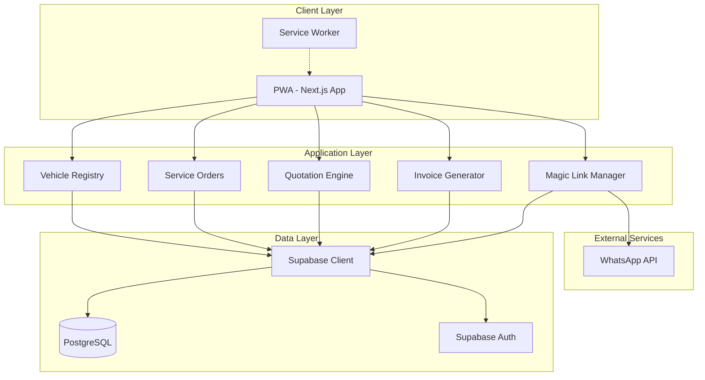

# Design Document: Taller CR MVP

## Overview

Taller CR is a Progressive Web Application built with Next.js 14 (TypeScript) that provides a complete workshop management solution for Costa Rican automotive repair shops. The application follows a mobile-first design philosophy with a clean, minimalist interface using the Inter font family and a blue-green color scheme.

The system architecture is organized around five core domains:
1. **Vehicle Management** - Registration and search functionality
2. **Service Order Management** - Order creation and tracking
3. **Quotation Engine** - Intelligent service selection with fiscal calculations
4. **Invoice Generation** - ATV v4.3 compliant electronic invoicing
5. **Client Communication** - Magic Links and WhatsApp integration

The application uses Supabase as the backend-as-a-service platform, providing PostgreSQL database storage, authentication, and real-time capabilities. All monetary calculations are performed in Costa Rican Colones (CRC) with automatic 13% IVA calculation.

## Architecture

### High-Level Architecture



### Technology Stack

**Frontend:**
- Framework: Next.js 14 (App Router)
- Language: TypeScript
- Styling: Tailwind CSS
- State Management: React Context + Hooks
- Forms: React Hook Form + Zod validation
- HTTP Client: Supabase Client

**Backend:**
- BaaS: Supabase (PostgreSQL + Auth + Realtime)
- Authentication: Supabase Auth (JWT)
- Storage: Supabase Storage (for future image uploads)

**PWA:**
- Service Worker: Workbox
- Manifest: next-pwa plugin

**Deployment:**
- Hosting: Vercel
- CDN: Vercel Edge Network
- Database: Supabase Cloud

### Directory Structure

```
taller-cr/
├── src/
│   ├── app/                    # Next.js App Router
│   │   ├── (auth)/
│   │   │   ├── login/
│   │   │   └── registro/
│   │   ├── (dashboard)/
│   │   │   ├── ordenes/
│   │   │   ├── vehiculos/
│   │   │   └── configuracion/
│   │   ├── orden/
│   │   │   └── [id]/          # Public client portal
│   │   ├── layout.tsx
│   │   └── page.tsx
│   ├── components/
│   │   ├── ui/                # Reusable UI components
│   │   ├── forms/             # Form components
│   │   ├── orders/            # Order-specific components
│   │   └── layout/            # Layout components
│   ├── lib/
│   │   ├── supabase/          # Supabase client & utilities
│   │   ├── fiscal/            # Tax calculation engine
│   │   ├── invoice/           # ATV invoice generator
│   │   └── utils/             # Helper functions
│   ├── types/                 # TypeScript type definitions
│   ├── hooks/                 # Custom React hooks
│   └── styles/
│       └── globals.css
├── public/
│   ├── manifest.json
│   ├── icons/
│   └── sw.js
├── supabase/
│   ├── migrations/
│   └── seed.sql
└── package.json
```

## Components and Interfaces

### Core Components

#### 1. Vehicle Registry Module

**VehicleSearchBar Component**
```typescript
interface VehicleSearchBarProps {
  onVehicleSelect: (vehicle: Vehicle) => void;
  onCreateNew: (placa: string) => void;
}

// Provides autocomplete search with debouncing
// Displays results with vehicle details
// Handles "not found" state with registration option
```

**VehicleRegistrationForm Component**
```typescript
interface VehicleRegistrationFormProps {
  initialPlaca?: string;
  onSuccess: (vehicle: Vehicle) => void;
}

// Validates plate format (ABC-123, TX-1234, A-12345)
// Required fields: placa, marca, modelo, año
// Optional fields: color, kilometraje, VIN
```

#### 2. Client Management Module

**ClientRegistrationForm Component**
```typescript
interface ClientRegistrationFormProps {
  onSuccess: (client: Client) => void;
}

// Dynamic validation based on ID type with specific Costa Rican formats:
// - Cédula Física: 9 digits (format: #-####-####)
// - Cédula Jurídica: 10 digits (format: #-###-######)
// - DIMEX: 11 or 12 digits (format: ###########)
// - NITE: 10 digits (format: ##########)
// - Pasaporte: alphanumeric, variable length
// Phone formatting: +506 ####-####
// Input masks applied automatically based on selected ID type
// Real-time validation with clear error messages
```

#### 3. Service Order Module

**OrderCreationWizard Component**
```typescript
interface OrderCreationWizardProps {
  vehicle: Vehicle;
  client?: Client;
}

// Multi-step wizard: Vehicle → Client → Services
// Auto-generates order number: ORD-YYYY-###
// Sets initial status: BORRADOR
```

**OrderStatusBadge Component**
```typescript
interface OrderStatusBadgeProps {
  status: OrderStatus;
}

// Color-coded status display
// BORRADOR: yellow, ENVIADA: blue, APROBADA: green
// FACTURADA: dark gray, COMPLETADA: light gray
```

#### 4. Quotation Engine Module

**ServiceSearchAutocomplete Component**
```typescript
interface ServiceSearchAutocompleteProps {
  onServiceSelect: (service: Service) => void;
}

// Searches pre-loaded CABYS catalog
// Displays: description, CABYS code, suggested price
// Supports custom service entry
```

**QuotationLineItem Component**
```typescript
interface QuotationLineItemProps {
  line: ServiceLineItem;
  onChange: (line: ServiceLineItem) => void;
  onRemove: () => void;
}

// Editable: descripción, cantidad, precio
// Displays: CABYS code, subtotal, IVA
// Real-time calculation updates
```

**QuotationSummary Component**
```typescript
interface QuotationSummaryProps {
  lines: ServiceLineItem[];
}

// Calculates and displays:
// - Subtotal (sum of all line totals)
// - IVA (13% of subtotal)
// - Total (subtotal + IVA)
// All amounts in CRC with 2 decimal places
```

#### 5. Magic Link Module

**MagicLinkGenerator Component**
```typescript
interface MagicLinkGeneratorProps {
  order: ServiceOrder;
  onGenerated: (link: string, token: string) => void;
}

// Validates order has client + services
// Generates UUID v4 token
// Creates URL: app.tallerprocrapp.com/orden/[id]?token=[uuid]
// Stores token with 72-hour expiry
```

**WhatsAppShareButton Component**
```typescript
interface WhatsAppShareButtonProps {
  order: ServiceOrder;
  magicLink: string;
}

// Formats WhatsApp message with:
// - Taller name
// - Vehicle info
// - Total amount
// - Magic Link
// Opens WhatsApp with pre-filled message
```

#### 6. Public Client Portal Module

**PublicOrderView Component**
```typescript
interface PublicOrderViewProps {
  orderId: string;
  token: string;
}

// Public route (no auth required)
// Validates token and expiry
// Displays: vehicle, services, totals, taller info
// Mobile-optimized layout
```

**OrderApprovalButton Component**
```typescript
interface OrderApprovalButtonProps {
  order: ServiceOrder;
  token: string;
  onApprove: () => void;
}

// Confirmation dialog before approval
// Updates order status to APROBADA
// Marks token as used
// Displays success message
```

#### 7. Invoice Generation Module

**InvoiceGenerator Component**
```typescript
interface InvoiceGeneratorProps {
  order: ServiceOrder;
  onGenerated: (invoiceJson: string) => void;
}

// Validates taller fiscal configuration
// Generates ATV v4.3 compliant JSON
// Includes: clave, emisor, receptor, detalleServicio, resumenFactura
// Updates order status to FACTURADA
```

**InvoiceDownloadButton Component**
```typescript
interface InvoiceDownloadButtonProps {
  invoiceJson: string;
  clave: string;
}

// Downloads JSON file: FE-[clave].json
// Option to copy to clipboard
```

#### 8. Dashboard Module

**OrderDashboard Component**
```typescript
interface OrderDashboardProps {
  tallerId: string;
}

// Lists all orders for taller
// Filters: Todas, Enviadas, Aprobadas, Facturadas
// Pagination: 20 per page
// Search functionality
```

**OrderCard Component**
```typescript
interface OrderCardProps {
  order: ServiceOrder;
  onEdit: () => void;
  onDuplicate: () => void;
  onDelete: () => void;
}

// Displays: order #, vehicle, client, status, amount, time
// Three-dot menu with actions
```

### Service Interfaces

#### Fiscal Calculation Service

```typescript
import Big from 'big.js';

interface FiscalCalculationService {
  calculateSubtotal(lines: ServiceLineItem[]): Big;
  calculateIVA(subtotal: Big): Big;
  calculateTotal(subtotal: Big, iva: Big): Big;
  formatCurrency(amount: Big): string;
  toCentimos(amount: Big): number; // Convert to integer centimos for storage
  fromCentimos(centimos: number): Big; // Convert from integer centimos
}

// All calculations use big.js for precision
// Monetary values stored as integers (centimos) in database
// IVA fixed at 13% (0.13)
// Display values formatted to 2 decimal places
// No floating-point arithmetic to avoid rounding errors
```

#### CABYS Catalog Service

```typescript
interface CABYSCatalogService {
  searchServices(query: string): Promise<Service[]>;
  getServiceByCode(cabysCode: string): Promise<Service | null>;
  addCustomService(service: Service, tallerId: string): Promise<void>;
  getTallerServices(tallerId: string): Promise<Service[]>;
}

// Pre-loaded with 20+ common services
// Taller-specific custom services
// Fuzzy search by description
```

#### Invoice Generation Service

```typescript
interface InvoiceGenerationService {
  generateInvoiceJSON(order: ServiceOrder, taller: Taller): ATVInvoice;
  generateClaveNumerica(taller: Taller, order: ServiceOrder): string;
  validateFiscalData(taller: Taller): ValidationResult;
}

// ATV v4.3 format compliance
// 50-digit clave generation
// Fiscal data validation
```

#### Magic Link Service

```typescript
interface MagicLinkService {
  generateToken(): string;
  createMagicLink(orderId: string, token: string): string;
  validateToken(token: string): Promise<TokenValidation>;
  markTokenAsUsed(token: string): Promise<void>;
  invalidateToken(token: string): Promise<void>;
}

// UUID v4 token generation
// 72-hour expiry
// Single-use enforcement
```

## Data Models

### Database Schema

#### Talleres Table
```sql
CREATE TABLE talleres (
  id UUID PRIMARY KEY DEFAULT uuid_generate_v4(),
  nombre VARCHAR(255) NOT NULL,
  cedula_juridica VARCHAR(20) UNIQUE NOT NULL,
  nombre_responsable VARCHAR(255) NOT NULL,
  telefono VARCHAR(20) NOT NULL,
  email VARCHAR(255) UNIQUE NOT NULL,
  
  -- Fiscal data (optional initially)
  nombre_comercial VARCHAR(255),
  actividad_economica VARCHAR(10),
  provincia VARCHAR(2),
  canton VARCHAR(2),
  distrito VARCHAR(2),
  barrio VARCHAR(2),
  otras_senas TEXT,
  
  created_at TIMESTAMP DEFAULT NOW(),
  updated_at TIMESTAMP DEFAULT NOW()
);

-- Indexes
CREATE INDEX idx_talleres_cedula ON talleres(cedula_juridica);
CREATE INDEX idx_talleres_email ON talleres(email);
```

#### Vehicles Table
```sql
CREATE TABLE vehicles (
  id UUID PRIMARY KEY DEFAULT uuid_generate_v4(),
  taller_id UUID REFERENCES talleres(id) ON DELETE CASCADE,
  placa VARCHAR(20) NOT NULL,
  marca VARCHAR(100) NOT NULL,
  modelo VARCHAR(100) NOT NULL,
  año INTEGER NOT NULL CHECK (año >= 1990 AND año <= 2025),
  color VARCHAR(50),
  kilometraje INTEGER,
  vin VARCHAR(17),
  
  created_at TIMESTAMP DEFAULT NOW(),
  updated_at TIMESTAMP DEFAULT NOW(),
  
  UNIQUE(taller_id, placa)
);

-- Indexes
CREATE INDEX idx_vehicles_placa ON vehicles(placa);
CREATE INDEX idx_vehicles_taller ON vehicles(taller_id);
```

#### Clients Table
```sql
CREATE TABLE clients (
  id UUID PRIMARY KEY DEFAULT uuid_generate_v4(),
  taller_id UUID REFERENCES talleres(id) ON DELETE CASCADE,
  nombre_completo VARCHAR(255) NOT NULL,
  tipo_identificacion VARCHAR(20) NOT NULL, -- 'fisica', 'juridica', 'dimex', 'nite', 'pasaporte'
  numero_identificacion VARCHAR(20) NOT NULL,
  telefono VARCHAR(20) NOT NULL,
  email VARCHAR(255),
  direccion TEXT,
  
  created_at TIMESTAMP DEFAULT NOW(),
  updated_at TIMESTAMP DEFAULT NOW(),
  
  UNIQUE(taller_id, numero_identificacion)
);

-- Indexes
CREATE INDEX idx_clients_taller ON clients(taller_id);
CREATE INDEX idx_clients_phone ON clients(telefono);
CREATE INDEX idx_clients_identification ON clients(numero_identificacion);
```

#### Service Orders Table
```sql
CREATE TABLE service_orders (
  id UUID PRIMARY KEY DEFAULT uuid_generate_v4(),
  taller_id UUID REFERENCES talleres(id) ON DELETE CASCADE,
  vehicle_id UUID REFERENCES vehicles(id) ON DELETE CASCADE,
  client_id UUID REFERENCES clients(id) ON DELETE CASCADE,
  
  order_number VARCHAR(50) UNIQUE NOT NULL, -- ORD-2024-001
  status VARCHAR(20) NOT NULL DEFAULT 'BORRADOR', -- BORRADOR, ENVIADA, APROBADA, FACTURADA, COMPLETADA
  motivo_ingreso TEXT,
  fecha_recepcion DATE NOT NULL DEFAULT CURRENT_DATE,
  
  subtotal_centimos INTEGER, -- Stored as integer centimos
  iva_centimos INTEGER, -- Stored as integer centimos
  total_centimos INTEGER, -- Stored as integer centimos
  
  invoice_json JSONB, -- ATV v4.3 invoice
  clave_numerica VARCHAR(50), -- 50-digit invoice key
  
  created_at TIMESTAMP DEFAULT NOW(),
  updated_at TIMESTAMP DEFAULT NOW()
);

-- Indexes
CREATE INDEX idx_orders_taller ON service_orders(taller_id);
CREATE INDEX idx_orders_vehicle ON service_orders(vehicle_id);
CREATE INDEX idx_orders_client ON service_orders(client_id);
CREATE INDEX idx_orders_number ON service_orders(order_number);
CREATE INDEX idx_orders_status ON service_orders(status);

-- Note: All monetary values stored as integers (centimos) for precision
```

#### Service Line Items Table
```sql
CREATE TABLE service_line_items (
  id UUID PRIMARY KEY DEFAULT uuid_generate_v4(),
  order_id UUID REFERENCES service_orders(id) ON DELETE CASCADE,
  numero_linea INTEGER NOT NULL,
  
  descripcion TEXT NOT NULL,
  cabys_code VARCHAR(13) NOT NULL,
  cantidad INTEGER NOT NULL DEFAULT 1,
  precio_unitario_centimos INTEGER NOT NULL, -- Stored as integer centimos to avoid floating-point errors
  
  subtotal_centimos INTEGER NOT NULL, -- cantidad * precio_unitario_centimos
  iva_centimos INTEGER NOT NULL, -- subtotal_centimos * 0.13, rounded
  total_linea_centimos INTEGER NOT NULL, -- subtotal_centimos + iva_centimos
  
  created_at TIMESTAMP DEFAULT NOW(),
  
  UNIQUE(order_id, numero_linea)
);

-- Indexes
CREATE INDEX idx_line_items_order ON service_line_items(order_id);

-- Note: All monetary values stored as integers (centimos) to ensure precision
-- Display values calculated as: centimos / 100
-- Example: 15000 centimos = ₡150.00
```

#### Order Tokens Table (Magic Links)
```sql
CREATE TABLE order_tokens (
  id UUID PRIMARY KEY DEFAULT uuid_generate_v4(),
  order_id UUID REFERENCES service_orders(id) ON DELETE CASCADE,
  token VARCHAR(255) UNIQUE NOT NULL,
  expires_at TIMESTAMP NOT NULL,
  used BOOLEAN DEFAULT FALSE,
  used_at TIMESTAMP,
  invalidated BOOLEAN DEFAULT FALSE,
  
  created_at TIMESTAMP DEFAULT NOW()
);

-- Indexes
CREATE INDEX idx_tokens_order ON order_tokens(order_id);
CREATE INDEX idx_tokens_token ON order_tokens(token);
CREATE INDEX idx_tokens_expires ON order_tokens(expires_at);
```

#### Services Catalog Table
```sql
CREATE TABLE services_catalog (
  id UUID PRIMARY KEY DEFAULT uuid_generate_v4(),
  taller_id UUID REFERENCES talleres(id) ON DELETE CASCADE, -- NULL for global services
  descripcion TEXT NOT NULL,
  cabys_code VARCHAR(13) NOT NULL,
  precio_sugerido_centimos INTEGER, -- Stored as integer centimos
  is_favorite BOOLEAN DEFAULT FALSE,
  is_global BOOLEAN DEFAULT FALSE, -- Pre-loaded services
  
  created_at TIMESTAMP DEFAULT NOW(),
  updated_at TIMESTAMP DEFAULT NOW()
);

-- Indexes
CREATE INDEX idx_services_taller ON services_catalog(taller_id);
CREATE INDEX idx_services_cabys ON services_catalog(cabys_code);
CREATE INDEX idx_services_global ON services_catalog(is_global);
```

#### Order Status History Table
```sql
CREATE TABLE order_status_history (
  id UUID PRIMARY KEY DEFAULT uuid_generate_v4(),
  order_id UUID REFERENCES service_orders(id) ON DELETE CASCADE,
  from_status VARCHAR(20),
  to_status VARCHAR(20) NOT NULL,
  changed_by UUID REFERENCES auth.users(id),
  changed_at TIMESTAMP DEFAULT NOW(),
  notes TEXT
);

-- Indexes
CREATE INDEX idx_status_history_order ON order_status_history(order_id);
```

### TypeScript Type Definitions

```typescript
// Core Types
type OrderStatus = 'BORRADOR' | 'ENVIADA' | 'APROBADA' | 'FACTURADA' | 'COMPLETADA';
type TipoIdentificacion = 'fisica' | 'juridica' | 'dimex' | 'nite' | 'pasaporte';

// Validation patterns for Costa Rican identification formats
const IDENTIFICATION_PATTERNS = {
  fisica: /^\d{1}-\d{4}-\d{4}$/, // 9 digits: #-####-####
  juridica: /^\d{1}-\d{3}-\d{6}$/, // 10 digits: #-###-######
  dimex: /^\d{11,12}$/, // 11 or 12 digits
  nite: /^\d{10}$/, // 10 digits
  pasaporte: /^[A-Z0-9]{6,20}$/ // Alphanumeric, 6-20 chars
} as const;

// Input masks for automatic formatting
const IDENTIFICATION_MASKS = {
  fisica: '#-####-####',
  juridica: '#-###-######',
  dimex: '############',
  nite: '##########',
  pasaporte: null // No mask, free format
} as const;

interface Taller {
  id: string;
  nombre: string;
  cedulaJuridica: string;
  nombreResponsable: string;
  telefono: string;
  email: string;
  nombreComercial?: string;
  actividadEconomica?: string;
  provincia?: string;
  canton?: string;
  distrito?: string;
  barrio?: string;
  otrasSenas?: string;
  createdAt: Date;
  updatedAt: Date;
}

interface Vehicle {
  id: string;
  tallerId: string;
  placa: string;
  marca: string;
  modelo: string;
  año: number;
  color?: string;
  kilometraje?: number;
  vin?: string;
  createdAt: Date;
  updatedAt: Date;
}

interface Client {
  id: string;
  tallerId: string;
  nombreCompleto: string;
  tipoIdentificacion: TipoIdentificacion;
  numeroIdentificacion: string; // Stored with formatting (e.g., "1-2345-6789")
  telefono: string; // Stored as +506 ####-####
  email?: string;
  direccion?: string;
  createdAt: Date;
  updatedAt: Date;
}

interface ServiceOrder {
  id: string;
  tallerId: string;
  vehicleId: string;
  clientId: string;
  orderNumber: string;
  status: OrderStatus;
  motivoIngreso?: string;
  fechaRecepcion: Date;
  subtotalCentimos?: number; // Integer centimos (e.g., 1500000 = ₡15,000.00)
  ivaCentimos?: number;
  totalCentimos?: number;
  invoiceJson?: ATVInvoice;
  claveNumerica?: string;
  createdAt: Date;
  updatedAt: Date;
}

interface ServiceLineItem {
  id: string;
  orderId: string;
  numeroLinea: number;
  descripcion: string;
  cabysCode: string;
  cantidad: number;
  precioUnitarioCentimos: number; // Integer centimos
  subtotalCentimos: number; // cantidad * precioUnitarioCentimos
  ivaCentimos: number; // subtotalCentimos * 0.13, rounded
  totalLineaCentimos: number; // subtotalCentimos + ivaCentimos
  createdAt: Date;
}

interface OrderToken {
  id: string;
  orderId: string;
  token: string;
  expiresAt: Date;
  used: boolean;
  usedAt?: Date;
  invalidated: boolean;
  createdAt: Date;
}

interface Service {
  id: string;
  tallerId?: string;
  descripcion: string;
  cabysCode: string;
  precioSugeridoCentimos?: number; // Integer centimos
  isFavorite: boolean;
  isGlobal: boolean;
  createdAt: Date;
  updatedAt: Date;
}

// Helper functions for monetary conversions
function toCentimos(amount: number): number {
  return Math.round(amount * 100);
}

function fromCentimos(centimos: number): number {
  return centimos / 100;
}

function formatCRC(centimos: number): string {
  const amount = fromCentimos(centimos);
  return `₡${amount.toLocaleString('es-CR', { minimumFractionDigits: 2, maximumFractionDigits: 2 })}`;
}

// ATV v4.3 Invoice Types
interface ATVInvoice {
  clave: string;
  codigoActividad: string;
  numeroConsecutivo: string;
  fechaEmision: string;
  emisor: ATVEmisor;
  receptor: ATVReceptor;
  condicionVenta: string;
  plazoCredito: string;
  medioPago: string[];
  detalleServicio: ATVDetalleServicio[];
  resumenFactura: ATVResumenFactura;
}

interface ATVEmisor {
  nombre: string;
  identificacion: {
    tipo: string;
    numero: string;
  };
  nombreComercial: string;
  ubicacion: {
    provincia: string;
    canton: string;
    distrito: string;
    barrio: string;
    otrasSenas: string;
  };
  telefono: {
    codigoPais: string;
    numTelefono: string;
  };
  correoElectronico: string;
}

interface ATVReceptor {
  nombre: string;
  identificacion: {
    tipo: string;
    numero: string;
  };
  telefono: {
    codigoPais: string;
    numTelefono: string;
  };
}

interface ATVDetalleServicio {
  numeroLinea: number;
  codigoComercial: Array<{
    tipo: string;
    codigo: string;
  }>;
  cantidad: number;
  unidadMedida: string;
  detalle: string;
  precioUnitario: number;
  montoTotal: number;
  subtotal: number;
  montoTotalLinea: number;
  impuesto: Array<{
    codigo: string;
    codigoTarifa: string;
    tarifa: number;
    monto: number;
  }>;
}

interface ATVResumenFactura {
  codigoTipoMoneda: {
    codigoMoneda: string;
    tipoCambio: number;
  };
  totalVentaNeta: number;
  totalImpuesto: number;
  totalComprobante: number;
}
```

## Correctness Properties

*A property is a characteristic or behavior that should hold true across all valid executions of a system—essentially, a formal statement about what the system should do. Properties serve as the bridge between human-readable specifications and machine-verifiable correctness guarantees.*


### Property 1: Registration Required Fields Validation
*For any* taller registration attempt, if any required field (nombre, cédula jurídica, nombre responsable, teléfono, email, contraseña) is missing, the registration should be rejected
**Validates: Requirements 1.1**

### Property 2: Cédula Jurídica Format Validation
*For any* string entered as cédula jurídica, it should be accepted if and only if it matches the format 3-###-###### (where # is a digit)
**Validates: Requirements 1.2**

### Property 3: Phone Number Format Validation
*For any* string entered as teléfono, it should be accepted if and only if it matches the format +506 ####-#### or can be normalized to this format
**Validates: Requirements 1.3**

### Property 4: Email Uniqueness Enforcement
*For any* taller registration attempt with an email that already exists in the system, the registration should be rejected with a clear error message
**Validates: Requirements 1.4**

### Property 5: Vehicle Search Case and Hyphen Insensitivity
*For any* vehicle placa stored in the system, searching with the same placa in different cases (uppercase/lowercase) or with/without hyphens should return the same vehicle
**Validates: Requirements 3.2**

### Property 6: Multi-Format Plate Acceptance
*For any* valid Costa Rican plate format (ABC-123 for particulares, TX-1234 for taxis, A-12345 for motos), the system should accept and store the vehicle
**Validates: Requirements 3.8**

### Property 7: Client Registration Required Fields
*For any* client registration attempt, if any required field (nombre completo, tipo identificación, número identificación, teléfono) is missing, the registration should be rejected
**Validates: Requirements 4.2**

### Property 8: Identification Number Validation by Type
*For any* client registration, the número de identificación should be validated according to its tipo and format:
- Cédula Física: 9 digits with format #-####-#### (e.g., "1-2345-6789")
- Cédula Jurídica: 10 digits with format #-###-###### (e.g., "3-101-123456")
- DIMEX: 11 or 12 digits without formatting (e.g., "123456789012")
- NITE: 10 digits without formatting (e.g., "1234567890")
- Pasaporte: alphanumeric 6-20 characters (e.g., "AB123456")
**Validates: Requirements 4.4, 4.5, 4.6, 4.7**

### Property 9: Order Number Format Generation
*For any* newly created service order, the generated order_number should match the format ORD-YYYY-### where YYYY is the current year and ### is a sequential number
**Validates: Requirements 5.2**

### Property 10: Initial Order Status
*For any* newly created service order, the initial status should be BORRADOR
**Validates: Requirements 5.4, 11.2**

### Property 11: CABYS Code Validation
*For any* service being added to a quotation, if the CABYS code is not exactly 13 digits, the service should be rejected
**Validates: Requirements 6.3**

### Property 12: Fiscal Calculation Correctness with Precision
*For any* quotation with service line items, the following must hold using arbitrary-precision arithmetic (big.js):
- subtotal_centimos = sum of all (cantidad × precio_unitario_centimos)
- iva_centimos = round(subtotal_centimos × 0.13)
- total_centimos = subtotal_centimos + iva_centimos
- all calculations performed without floating-point errors
- display values = centimos / 100, formatted to 2 decimal places
**Validates: Requirements 7.1, 7.2, 7.3, 7.5**

### Property 12a: Monetary Storage Precision
*For any* monetary value stored in the database, it should be stored as an integer representing centimos (e.g., ₡150.00 = 15000 centimos) to prevent floating-point rounding errors
**Validates: Requirements 7.5**

### Property 13: Invoice Generation Prerequisites
*For any* attempt to generate an invoice, if the taller's fiscal configuration is incomplete (missing: dirección, actividad económica, nombre comercial), the generation should fail with a clear error message
**Validates: Requirements 8.2**

### Property 14: Clave Numérica Format and Uniqueness
*For any* generated invoice, the clave numérica should be exactly 50 digits long and unique across all invoices in the system
**Validates: Requirements 8.6**

### Property 15: Invoice JSON Structure Completeness
*For any* generated invoice JSON, it must contain all required ATV v4.3 fields: clave, emisor (with identificación, ubicación, teléfono, correoElectronico), receptor (with identificación, teléfono), detalleServicio array, resumenFactura (with codigoTipoMoneda, totalVentaNeta, totalImpuesto, totalComprobante)
**Validates: Requirements 8.9**

### Property 16: Magic Link Generation Prerequisites
*For any* attempt to generate a Magic Link, if the order lacks a client with teléfono or has zero service line items, the generation should fail
**Validates: Requirements 9.1**

### Property 17: Magic Link Token Uniqueness and Format
*For any* generated Magic Link token, it should be a valid UUID v4 format and unique across all tokens in the system
**Validates: Requirements 9.2**

### Property 18: Magic Link Expiry Calculation
*For any* generated Magic Link, the expires_at timestamp should be exactly 72 hours (259200 seconds) after the creation timestamp
**Validates: Requirements 9.4**

### Property 19: Token Validation Rules
*For any* Magic Link access attempt, the token should be rejected if: (1) it doesn't exist in the database, (2) current time > expires_at, or (3) used = true
**Validates: Requirements 9.8**

### Property 20: Order Approval State Transition
*For any* order approval via Magic Link, the order status should transition to APROBADA and the token's used field should be set to true
**Validates: Requirements 10.6, 10.7**

### Property 21: Single-Use Token Enforcement
*For any* Magic Link token, after it has been used once (used = true), any subsequent approval attempt with the same token should be rejected
**Validates: Requirements 10.7**

### Property 22: Order State Machine Transitions
*For any* service order, the following state transitions should be enforced:
- BORRADOR → ENVIADA (when Magic Link generated)
- ENVIADA → APROBADA (when client approves)
- APROBADA → FACTURADA (when invoice generated)
- FACTURADA → COMPLETADA (when marked complete)
- ENVIADA → BORRADOR (when order edited)
**Validates: Requirements 11.3, 11.4, 11.7**

### Property 23: Facturada Order Edit Prevention
*For any* order with status FACTURADA, any attempt to edit the order should be rejected
**Validates: Requirements 11.8**

### Property 24: Order Filtering Correctness
*For any* filter selection (Enviadas, Aprobadas, Facturadas), the returned orders should contain only orders matching that exact status
**Validates: Requirements 12.4**

### Property 25: Multi-Field Search Coverage
*For any* search query, if an order matches the query in any of these fields (order_number, vehicle placa, client name, client phone), it should appear in the search results
**Validates: Requirements 13.2**

### Property 26: Order Duplication Correctness
*For any* order duplication, the new order should have: same vehicle_id, same client_id, same service line items (descripción, cabys_code, cantidad, precio_unitario), status BORRADOR, and a new unique order_number
**Validates: Requirements 14.2**

### Property 27: Multi-Tenant Data Isolation
*For any* taller, queries should never return data (vehicles, clients, orders) belonging to a different taller
**Validates: Requirements 19.4**

### Property 28: Sensitive Data Masking
*For any* cédula or identification number displayed in list views, only the last 4 digits should be visible, with the rest masked (e.g., "******5678")
**Validates: Requirements 19.9**

## Error Handling

### Monetary Precision Best Practices

**Critical Requirement**: To avoid floating-point rounding errors in Costa Rican Colones (CRC), the system implements the following precision strategy:

**Storage Strategy:**
- All monetary values stored as INTEGER in database (centimos/sub-units)
- Example: ₡150.00 stored as 15000 centimos
- Example: ₡1,234.56 stored as 123456 centimos
- No DECIMAL or FLOAT types used for money

**Calculation Strategy:**
- Use big.js library for all monetary calculations
- Perform all arithmetic in centimos (integers)
- IVA calculation: `iva_centimos = Math.round(subtotal_centimos * 0.13)`
- Rounding only at final display step

**Display Strategy:**
- Convert centimos to display value: `amount = centimos / 100`
- Format with 2 decimal places: `₡${amount.toFixed(2)}`
- Use locale formatting: `amount.toLocaleString('es-CR', { minimumFractionDigits: 2 })`

**Example Calculation Flow:**
```typescript
import Big from 'big.js';

// Input: Service with precio ₡15,000.00
const precioUnitarioCentimos = 1500000; // Stored as integer

// Calculate line total
const cantidad = 2;
const subtotalCentimos = cantidad * precioUnitarioCentimos; // 3000000

// Calculate IVA using Big.js for precision
const subtotalBig = new Big(subtotalCentimos);
const ivaBig = subtotalBig.times(0.13).round(0); // Round to nearest centimo
const ivaCentimos = ivaBig.toNumber(); // 390000

// Calculate total
const totalCentimos = subtotalCentimos + ivaCentimos; // 3390000

// Display values
const subtotalDisplay = subtotalCentimos / 100; // 30000.00
const ivaDisplay = ivaCentimos / 100; // 3900.00
const totalDisplay = totalCentimos / 100; // 33900.00

console.log(`Subtotal: ₡${subtotalDisplay.toFixed(2)}`); // ₡30,000.00
console.log(`IVA (13%): ₡${ivaDisplay.toFixed(2)}`); // ₡3,900.00
console.log(`Total: ₡${totalDisplay.toFixed(2)}`); // ₡33,900.00
```

**Why This Matters:**
- JavaScript's `0.1 + 0.2 !== 0.3` problem avoided
- Exact IVA calculation required by Hacienda
- No cumulative rounding errors across multiple line items
- Consistent totals in quotations and invoices

### Validation Errors

**Input Validation Strategy:**
- All user inputs are validated on both client and server side
- Client-side validation provides immediate feedback using React Hook Form + Zod
- Server-side validation ensures data integrity even if client validation is bypassed
- Validation errors return structured error objects with field-specific messages
- Input masks applied automatically for formatted fields (cédulas, phone numbers)

**Common Validation Scenarios:**
1. **Format Validation with Masks**: 
   - Cédula Jurídica: 3-###-###### (auto-formatted as user types)
   - Cédula Física: #-####-#### (auto-formatted)
   - DIMEX: ############ (numeric only, no formatting)
   - NITE: ########## (numeric only, no formatting)
   - Phone numbers: +506 ####-#### (auto-formatted)
   - Plate numbers: ABC-123, TX-1234, A-12345 (normalized on save)
   - CABYS codes: ############# (13 digits, numeric only)
2. **Required Fields**: Registration forms, order creation, client registration
3. **Uniqueness**: Email addresses, order numbers, clave numérica
4. **Range Validation**: Vehicle year (1990-2025), monetary amounts (> 0)
5. **Length Validation**: VIN (17 characters), CABYS (13 digits), clave (50 digits)

**Input Mask Implementation:**
```typescript
// Using react-input-mask or similar library
const MASKS = {
  cedulaFisica: '9-9999-9999',
  cedulaJuridica: '9-999-999999',
  telefono: '+506 9999-9999',
  placaParticular: 'AAA-999',
  placaTaxi: 'AA-9999',
  placaMoto: 'A-99999'
};

// Validation patterns
const PATTERNS = {
  cedulaFisica: /^\d{1}-\d{4}-\d{4}$/,
  cedulaJuridica: /^\d{1}-\d{3}-\d{6}$/,
  dimex: /^\d{11,12}$/,
  nite: /^\d{10}$/,
  telefono: /^\+506 \d{4}-\d{4}$/,
  cabys: /^\d{13}$/
};
```

### Business Logic Errors

**Order State Errors:**
- Attempting to edit FACTURADA orders → Error: "No se puede editar una orden facturada"
- Generating Magic Link without services → Error: "Agregue al menos un servicio antes de enviar"
- Generating invoice without fiscal data → Error: "Complete su información fiscal en Configuración"

**Token Errors:**
- Expired Magic Link → Display: "Este link ya expiró. Contacte al taller."
- Already used token → Display: "Esta cotización ya fue aprobada el [fecha]"
- Invalid token → Display: "Link inválido. Verifique la URL."

**Fiscal Calculation Errors:**
- Invalid CABYS code → Error: "Código CABYS debe tener exactamente 13 dígitos"
- Negative or zero prices → Error: "El precio debe ser mayor a cero"
- Missing IVA calculation → System automatically calculates, no user error possible

### Database Errors

**Connection Errors:**
- Supabase connection timeout → Display: "Error de conexión. Verifique su internet."
- Retry strategy: 3 attempts with exponential backoff (1s, 2s, 4s)

**Constraint Violations:**
- Duplicate email → Error: "Este email ya está registrado"
- Duplicate order number → System auto-generates new number
- Foreign key violations → Error: "Datos relacionados no encontrados"

**Transaction Errors:**
- Order creation with line items uses database transactions
- If any part fails, entire transaction rolls back
- User sees: "Error al guardar. Intente nuevamente."

### Network Errors

**Offline Handling:**
- Service Worker caches critical pages and assets
- When offline, display banner: "Sin conexión - Mostrando datos guardados"
- Form submissions queued locally and synced when online
- Background sync API for pending operations

**Slow Connection Handling:**
- Loading spinners for operations > 500ms
- Timeout after 30 seconds with retry option
- Image lazy loading with placeholders
- Optimistic UI updates for better perceived performance

### User-Facing Error Messages

**Error Message Principles:**
1. **Clear and Specific**: "Cédula jurídica debe tener formato 3-###-######"
2. **Actionable**: "Complete su información fiscal en Configuración"
3. **In Spanish**: All messages in user's language
4. **Non-Technical**: Avoid technical jargon, database errors, stack traces

**Error Display Methods:**
- **Toast Notifications**: For transient errors (network, save confirmation)
- **Inline Field Errors**: For form validation (red text below input)
- **Modal Dialogs**: For critical errors requiring acknowledgment
- **Banner Messages**: For system-wide issues (offline mode)

### Logging and Monitoring

**Error Logging Strategy:**
- All errors logged to Supabase with structured JSON format
- Log levels: ERROR (critical), WARN (recoverable), INFO (audit trail)
- Logged data: timestamp, user_id, taller_id, error_type, error_message, stack_trace, request_context

**Monitoring Alerts:**
- High error rate (> 5% of requests) → Alert admin
- Database connection failures → Immediate alert
- Invoice generation failures → Alert for manual review
- Token validation failures (potential security issue) → Alert

## Testing Strategy

### Dual Testing Approach

The system will be validated using both **unit tests** and **property-based tests** to ensure comprehensive coverage:

**Unit Tests:**
- Verify specific examples and edge cases
- Test integration points between components
- Validate error conditions and boundary cases
- Focus on concrete scenarios with known inputs/outputs

**Property-Based Tests:**
- Verify universal properties across all inputs
- Use randomized input generation to discover edge cases
- Validate correctness properties defined in this document
- Run minimum 100 iterations per property test

Both testing approaches are complementary and necessary for comprehensive validation.

### Property-Based Testing Configuration

**Framework Selection:**
- **JavaScript/TypeScript**: fast-check library
- Minimum 100 iterations per property test (configurable up to 1000 for critical properties)
- Shrinking enabled to find minimal failing examples
- Seed-based reproducibility for failed tests

**Property Test Tagging:**
Each property-based test must include a comment tag referencing the design document property:
```typescript
// Feature: taller-cr-mvp, Property 12: Fiscal Calculation Correctness
test('fiscal calculations are always correct', () => {
  fc.assert(
    fc.property(
      fc.array(serviceLineItemArbitrary, { minLength: 1, maxLength: 20 }),
      (lines) => {
        const result = calculateQuotationTotals(lines);
        const expectedSubtotal = lines.reduce((sum, line) => 
          sum + (line.cantidad * line.precioUnitario), 0);
        const expectedIVA = expectedSubtotal * 0.13;
        const expectedTotal = expectedSubtotal + expectedIVA;
        
        expect(result.subtotal).toBeCloseTo(expectedSubtotal, 2);
        expect(result.iva).toBeCloseTo(expectedIVA, 2);
        expect(result.total).toBeCloseTo(expectedTotal, 2);
      }
    ),
    { numRuns: 100 }
  );
});
```

### Unit Testing Strategy

**Test Organization:**
- Co-located with source files using `.test.ts` suffix
- Grouped by module: fiscal, invoice, magic-link, validation
- Use descriptive test names: `should reject cédula with invalid format`

**Critical Unit Tests:**
1. **Fiscal Calculations with Precision**: 
   - Test specific amounts with known IVA results
   - Test edge cases: ₡0.01, ₡999,999.99, large sums
   - Test rounding: amounts that produce fractional centimos
   - Verify no floating-point errors: 0.1 + 0.2 scenarios
   - Test cumulative calculations across multiple line items
   - Verify centimos storage and display conversion
2. **Format Validation with Masks**: 
   - Test valid/invalid formats for cédula física, jurídica, DIMEX, NITE
   - Test input mask behavior: auto-formatting, cursor position
   - Test paste behavior with pre-formatted and unformatted text
3. **State Transitions**: Test each allowed and disallowed transition
4. **Token Generation**: Test UUID format, uniqueness, expiry calculation
5. **Invoice JSON**: Test structure matches ATV v4.3 schema
6. **Search Functionality**: Test case-insensitivity, hyphen handling
7. **Multi-Tenant Isolation**: Test RLS policies prevent cross-taller access

**Edge Cases to Test:**
- Empty strings, null values, undefined
- Maximum length inputs
- Special characters in text fields
- Boundary values (year 1990, 2025)
- Concurrent operations (duplicate order numbers)
- Token expiry edge cases (exactly at expiry time)
- Monetary precision: ₡0.01, ₡0.13 (IVA on ₡1.00), ₡999,999.99
- Rounding edge cases: amounts where IVA produces .5 centimos
- Large quotations: 100+ line items, cumulative precision

### Integration Testing

**API Integration Tests:**
- Test complete flows: registration → order creation → quotation → approval → invoice
- Use test database with isolated data
- Clean up test data after each run
- Mock external services (WhatsApp, email)

**Database Integration Tests:**
- Test RLS policies with different user contexts
- Test foreign key constraints
- Test unique constraints
- Test transaction rollbacks on errors

### End-to-End Testing

**Critical User Flows:**
1. **Taller Registration Flow**: Register → Login → Configure fiscal data
2. **Order Creation Flow**: Search vehicle → Create order → Add services → Send to client
3. **Client Approval Flow**: Access Magic Link → View quotation → Approve
4. **Invoice Generation Flow**: Approved order → Generate invoice → Download JSON

**E2E Test Tools:**
- Playwright or Cypress for browser automation
- Test on mobile viewport (375px width)
- Test offline scenarios with service worker
- Test PWA installation flow

### Performance Testing

**Load Testing:**
- Simulate 100 concurrent users
- Test database query performance with 10,000+ orders
- Measure API response times under load
- Test service worker caching effectiveness

**Performance Benchmarks:**
- Service search: < 200ms (p95)
- Invoice generation: < 1s (p95)
- Page load (3G): < 3s (p95)
- Database queries: < 100ms (p95)

### Security Testing

**Security Test Cases:**
1. **SQL Injection**: Test all input fields with SQL injection payloads
2. **XSS**: Test text inputs with script tags and event handlers
3. **CSRF**: Verify all state-changing operations require valid tokens
4. **RLS Bypass**: Attempt to access other taller's data with manipulated queries
5. **Token Guessing**: Verify UUID v4 tokens are not predictable
6. **Expired Token Access**: Verify expired tokens are rejected

### Test Data Management

**Test Data Strategy:**
- Seed database with 20 pre-loaded CABYS services
- Generate test talleres, vehicles, clients, orders
- Use factories for consistent test data generation
- Separate test and production databases

**CABYS Test Data:**
```typescript
const testCABYSServices = [
  { codigo: '8527101010000', descripcion: 'Servicios de cambio de aceite para vehículos', precio: 15000 },
  { codigo: '8527201010000', descripcion: 'Servicios de reparación del sistema de frenos', precio: 45000 },
  { codigo: '8527301010000', descripcion: 'Servicios de reparación de la suspensión', precio: 35000 },
  // ... 17 more services
];
```

### Continuous Integration

**CI Pipeline:**
1. Lint code (ESLint, Prettier)
2. Type check (TypeScript)
3. Run unit tests (Jest)
4. Run property-based tests (fast-check)
5. Run integration tests
6. Build application
7. Deploy to staging (on main branch)

**Test Coverage Goals:**
- Unit test coverage: > 80% for business logic
- Property test coverage: All 28 correctness properties
- Integration test coverage: All critical user flows
- E2E test coverage: Top 5 user journeys

### Test Execution

**Local Development:**
```bash
npm run test              # Run all tests
npm run test:unit         # Unit tests only
npm run test:property     # Property-based tests only
npm run test:integration  # Integration tests
npm run test:e2e          # End-to-end tests
npm run test:watch        # Watch mode for TDD
```

**CI Environment:**
- All tests run on every pull request
- Property tests run with 100 iterations
- E2E tests run on staging environment
- Performance tests run nightly

---

## Implementation Notes

### Dependencies and Libraries

**Core Dependencies:**
```json
{
  "dependencies": {
    "next": "^14.0.0",
    "react": "^18.2.0",
    "react-dom": "^18.2.0",
    "typescript": "^5.0.0",
    "@supabase/supabase-js": "^2.38.0",
    "@supabase/auth-helpers-nextjs": "^0.8.0",
    "big.js": "^6.2.1",
    "@types/big.js": "^6.2.2",
    "react-hook-form": "^7.48.0",
    "@hookform/resolvers": "^3.3.0",
    "zod": "^3.22.0",
    "react-input-mask": "^2.0.4",
    "@types/react-input-mask": "^3.0.5",
    "uuid": "^9.0.0",
    "@types/uuid": "^9.0.0",
    "date-fns": "^2.30.0",
    "tailwindcss": "^3.3.0",
    "autoprefixer": "^10.4.0",
    "postcss": "^8.4.0"
  },
  "devDependencies": {
    "@types/node": "^20.0.0",
    "@types/react": "^18.2.0",
    "eslint": "^8.0.0",
    "eslint-config-next": "^14.0.0",
    "prettier": "^3.0.0",
    "jest": "^29.0.0",
    "@testing-library/react": "^14.0.0",
    "@testing-library/jest-dom": "^6.0.0",
    "fast-check": "^3.13.0",
    "next-pwa": "^5.6.0",
    "workbox-webpack-plugin": "^7.0.0"
  }
}
```

**Key Library Purposes:**
- **big.js**: Arbitrary-precision decimal arithmetic for fiscal calculations
- **react-input-mask**: Automatic input formatting for cédulas and phone numbers
- **zod**: Runtime type validation and schema definition
- **react-hook-form**: Form state management with validation
- **uuid**: UUID v4 generation for Magic Link tokens
- **fast-check**: Property-based testing framework
- **next-pwa**: PWA support for Next.js

### Phase 1: Core Infrastructure (Week 1-2)
1. Next.js project setup with TypeScript and Tailwind
2. Supabase project creation and database schema
3. Authentication setup with Supabase Auth
4. PWA configuration (manifest, service worker)
5. Design system implementation (colors, typography, components)

### Phase 2: Taller Management (Week 2-3)
1. Taller registration and login
2. Fiscal configuration page
3. Dashboard layout and navigation
4. User profile management

### Phase 3: Vehicle and Client Management (Week 3-4)
1. Vehicle search and registration
2. Client registration
3. Vehicle history view
4. Search functionality

### Phase 4: Order and Quotation (Week 4-6)
1. Order creation wizard
2. Service catalog with CABYS codes
3. Quotation engine with fiscal calculations
4. Order dashboard with filters
5. Order duplication

### Phase 5: Magic Links and Client Portal (Week 6-7)
1. Magic Link generation
2. Token management
3. Public client portal
4. WhatsApp integration
5. Order approval flow

### Phase 6: Invoice Generation (Week 7-8)
1. ATV v4.3 invoice JSON generator
2. Clave numérica generation
3. Invoice download functionality
4. Order state management

### Phase 7: Testing and Polish (Week 8-10)
1. Unit tests for all modules
2. Property-based tests for correctness properties
3. Integration tests
4. E2E tests for critical flows
5. Performance optimization
6. Security audit
7. Accessibility improvements
8. User acceptance testing

### Technical Debt and Future Improvements
- Real Hacienda API integration (requires digital certificate)
- Image upload for vehicle damage documentation
- PDF generation for quotations and invoices
- Email notifications
- SMS notifications (alternative to WhatsApp)
- Multi-language support (English)
- Dark mode
- Advanced analytics dashboard
- Mobile native apps (React Native)
- Offline-first architecture improvements
